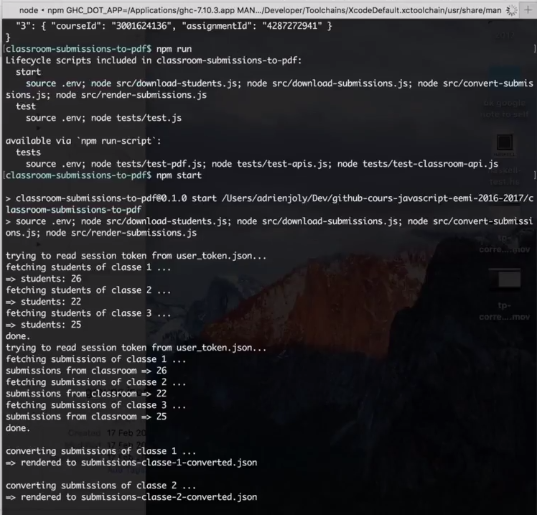

# classroom-assignments-cli

Fetches student-submitted URLs from Google Classroom



Forked from [adrienjoly/classroom-submissions-to-pdf](https://github.com/adrienjoly/classroom-submissions-to-pdf).

## Usage

```sh
$ npm install
$ npm start
```

## Setup

Before running, don't forget to:

1. create an app and web client auth on [Google Developer Console](https://console.developers.google.com/);   
2. and set the corresponding environment variables: `GCLA_CLIENT_ID`, `GCLA_CLIENT_SECRET` and `GCLA_REDIRECT_URL` (note: you can store them in a `.env` file)
3. run `npm run list` to list the course and courseworks associated to your google account (requires login or valid session)
4. populate the `courseId` and `assignmentId` of your classroom(s) in `groups.json`

All `npm` scripts that can be used are listed in the `package.json` file.

## Run tests

```sh
$ npm test        # => tests the Google API
```
